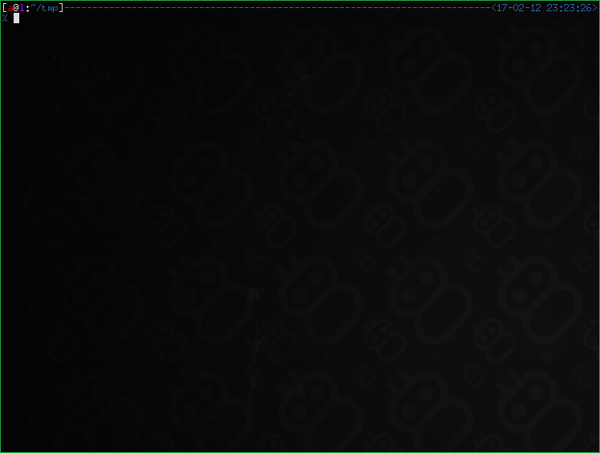

# wuzz

Interactive cli tool for HTTP inspection.

Wuzz command line arguments are similar to cURL's arguments,
so it can be used to inspect/modify requests copied from the
browser's network inspector with the "copy as cURL" feature.




## Installation and usage

```
$ go install github.com/asciimoo/wuzz@latest
$ "$GOPATH/bin/wuzz" --help
```

Note: golang >= 1.10 required.

[Binary releases](https://github.com/asciimoo/wuzz/releases) are also available.


### Configuration

It is possible to override default settings in a configuration file.
The default location is `"$XDG_CONFIG_HOME/wuzz/config.toml"`on linux
and `~/.wuzz/config.toml` on other platforms.
`-c`/`--config` switches can be used to load config file from custom location.

See [example configuration](sample-config.toml) for more details.


### Commands

Keybinding                              | Description
----------------------------------------|---------------------------------------
<kbd>F1</kbd>                           | Display help
<kbd>Ctrl+R</kbd>                       | Send request
<kbd>Ret</kbd>                          | Send request (only from URL view)
<kbd>Ctrl+S</kbd>                       | Save response
<kbd>Ctrl+E</kbd>                       | Save request
<kbd>Ctrl+F</kbd>                       | Load request
<kbd>Ctrl+C</kbd>                       | Quit
<kbd>Ctrl+K</kbd>, <kbd>Shift+Tab</kbd> | Previous view
<kbd>Ctlr+J</kbd>, <kbd>Tab</kbd>       | Next view
<kbd>Ctlr+T</kbd>                       | Toggle context specific search
<kbd>Alt+H</kbd>                        | Toggle history
<kbd>Down</kbd>                         | Move down one view line
<kbd>Up</kbd>                           | Move up one view line
<kbd>Page down</kbd>                    | Move down one view page
<kbd>Page up</kbd>                      | Move up one view page
<kbd>F2</kbd>                           | Jump to URL
<kbd>F3</kbd>                           | Jump to query parameters
<kbd>F4</kbd>                           | Jump to HTTP method
<kbd>F5</kbd>                           | Jump to request body
<kbd>F6</kbd>                           | Jump to headers
<kbd>F7</kbd>                           | Jump to search
<kbd>F8</kbd>                           | Jump to response headers
<kbd>F9</kbd>                           | Jump to response body
<kbd>F11</kbd>                          | Redirects Restriction Mode


### Context specific search

Wuzz accepts regular expressions by default to filter response body.
Custom query syntax can be toggled by pressing <kbd>Ctrl+T</kbd>.
The following formats have context specific search syntax:

Response format  | Query syntax
-----------------|----------------------------------------
HTML             | https://github.com/PuerkitoBio/goquery
JSON             | https://github.com/tidwall/gjson


## TODO

* Better navigation
* Autocompletion
* Tests


## Bugs / Suggestions

Bugs or suggestions? Visit the [issue tracker](https://github.com/asciimoo/wuzz/issues)
or join `#wuzz` on freenode
